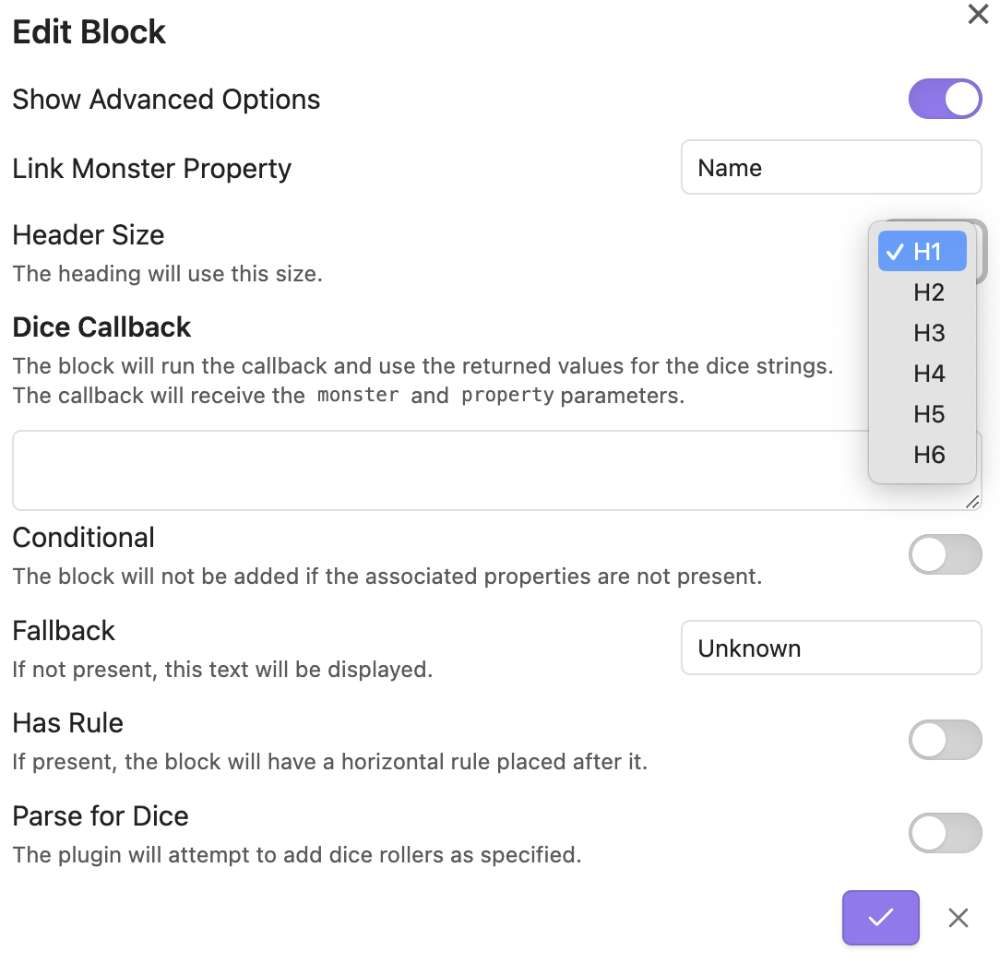

# The Heading Blocks

Heading blocks will render text in one of the Obsidian H1-H6 text styles. By default, this text is larger, but can be changed with custom css.

## Details

**+** Type: *Heading*
**+** Link: `monster.key`
**+** Encoding: *String*

{: .note }
>
>{: .d-flex }