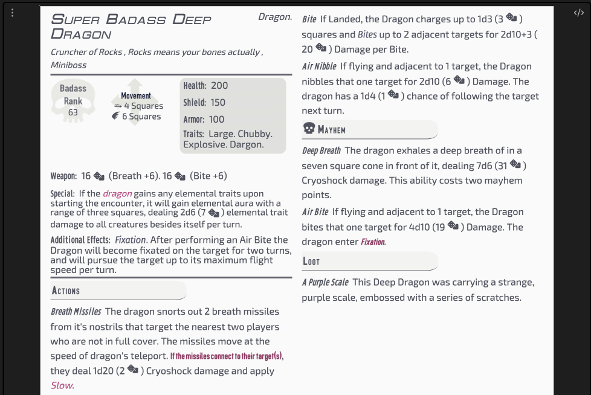

[[Fantasy Statblocks|Fantasy Statblocks]] > [[Integrated Layouts|Integrated Statblock Layouts]] > *You Are Here*

## Description

This is a layout for all Bestiary Entries for Bunkers and Badasses TTRPG.

A legal disclosure is included at the end of this page.

## Sample Image

>[!screenshot]- Screenshot of the Bestiary Statblock
> 


## BnB Bestiary Code Block

````yaml
```statblock
# Layouts until other style of releases should be BunkersBestiary
layout: Basic BnB Bestiary Layout
source: Bunkers-Example
dice: true
# If Its a Badass or a SuperBadass, make sure to put that First… Badass Potion Master… SuperBadass Treant
Token:
Name: "Super Badass Deep Dragon"
# "Landshark."
Type: "Dragon."
# Title of the Boss here, like King of the Hill or Wakisobi
TitleOfMob: "Cruncher of Rocks"
# Flavor Text Here such as Really Loves Fish
FlavorText: "Rocks means your bones actually"
# Miniboss, NPC, Made-Up Boss…
TypeOfBoss: "Miniboss"
# Self Explanatory, right? What is its BR
BadassRank: 63
# Options are move, flight, swim, burrow, teleport, hover, leap, climb, 
MovementType: "move 4 flight 6"
# Hitpoints
Health: "200"
# Shield Points
Shield: 150
# Armor Points
Armor: 100
# Any existing Traits. Want to randomize it? Add Random, Random 2, or Random 3. 
Traits: "Large. Chubby. Explosive. Dargon."
# What weapon does it use?
Weapon: "Breath +6. Bite +6"
# Any special stuff we ought to know?
Special: "If the [[dragon]] gains any elemental traits upon starting the encounter, it will gain elemental aura with a range of three squares, dealing 2d6 (2d6) elemental trait damage to all creatures besides itself per turn."
# Super_Special is for use with some weird entities like Potion Master and some Bosses. Usually leave the name blank as "".
SuperSpecial: "___Fixation___. After performing an Air Bite the Dragon will become fixated on the target for two turns, and will pursue the target up to its maximum flight speed per turn."
# Main Actions. Leave Empty if None
Actions:
  - name: Breath Missiles
    desc: "The dragon snorts out 2 breath missiles from it's nostrils that target the nearest two players who are not in full cover. The missiles move at the speed of dragon's teleport. __If the missiles connect to their target(s)__, they deal 1d20 (1d2) Cryoshock damage and apply [[BnB-Slow|Slow]]."
  - name: Bite
    desc: "If Landed, the Dragon charges up to 1d3 (1d3) squares and _Bites_ up to 2 adjacent targets for 2d10+3 (3d10+3) Damage per Bite."
  - name: Air Nibble
    desc: "If flying and adjacent to 1 target, the Dragon nibbles that one target for 2d10 (1d10) Damage. The dragon has a 1d4 (1d4) chance of following the target next turn."
# Mayhem Actions. Leave Empty if None
Mayhem:
  - name: Deep Breath
    desc: "The dragon exhales a deep breath of in a seven square cone in front of it, dealing 7d6 (7d6) Cryoshock damage. This ability costs two mayhem points."
  - name: Air Bite
    desc: "If flying and adjacent to 1 target, the Dragon bites that one target for 4d10 (4d10) Damage. The dragon enter ___[[BnB-fixation|Fixation]]___."
# Does this Entity Carry Super Special Loot? Leave Empty if None
Loot:
  - name: A Purple Scale
    desc: "This Deep Dragon was carrying a strange, purple scale, embossed with a series of scratches."
# Does this Entity Have an Image? Accepts Wikilink or Markdown Link. Leave Empty if None
Image: 
  ```
````

### BNB Bestiary Empty Codeblock

````yaml
```statblock
layout: Basic BnB Bestiary Layout
source: Bunkers-Example
dice: true
# If Its a Badass or a SuperBadass, make sure to put that First… Badass Potion Master… SuperBadass Treant
Token: Wikilink
Name: "String"
# "Landshark."
Type: "String."
# Title of the Boss here, like King of the Hill or Wakisobi
TitleOfMob: "String"
# Flavor Text Here such as Really Loves Fish
FlavorText: "Stringy"
# Miniboss, NPC, Made-Up Boss…
TypeOfBoss: "Miniboss"
# Self Explanatory, right? What is its BR
BadassRank: Integer
# Options are move, flight, swim, burrow, teleport, hover, leap, climb, 
MovementType: "movement interger"
# Hitpoints
Health: "integer"
# Shield Points
Shield: integer or nothing
# Armor Points
Armor: integer or nothing
# Any existing Traits. Want to randomize it? Add Random, Random 2, or Random 3. 
Traits: "string. string. string."
# What weapon does it use?
Weapon: "Strings and Integers"
# Any special stuff we ought to know?
Special: "String"
# Super_Special is for use with some weird entities like Potion Master and some Bosses. Usually leave the name blank as "".
SuperSpecial: "String"
# Main Actions. Leave Empty if None
Actions:
  - name: String
    desc: "String"
  - name: String
    desc: "String"
  - name: String
    desc: "String"
# Mayhem Actions. Leave Empty if None
Mayhem:
  - name: String
    desc: "String"
  - name: String
    desc: "String"
# Does this Entity Carry Super Special Loot? Leave Empty if None
Loot:
  - name: String
    desc: "String"
# Does this Entity Have an Image? Accepts Wikilink or Markdown Link. Leave Empty if None
Image: Wikilink
  ```
```
````

## Callbacks Used

### MovementType

This script,
built into the layout, converts `move`, `flight`, `swim`,`burrow`, `teleport`, `leap`, `hover`, and `climb` into icons.

An integer should follow each movement type. For example:

- `move 10`
- `swim 3`
- `fly 1`

```js
const Move = monster.MovementType;
const Types = ['move', 'flight', 'swim', 'burrow', 'teleport', 'leap', 'hover', 'climb',];
const Symbols = ['⭇', '󡔂', '󡔄', '󡔆', '󡔃', '󡔁', '󡔀', '󡔅',];

let Output = '';
for (let i = 0; i < Types.length; i++) {
  for (let j = 0; j <= 10; j++) {
    if (Move.includes(`${Types[i]} ${j}`)) {
      Output += `${Symbols[i]} ${j} Square${j > 1 ? 's' : ''}\n`;
    }
  }
}

return Output.trim();
```

## Legal Disclosure

Bunkers & Badasses and its associated content within the Borderlands Universe are copyrighted and trademarked to their respective entities within Nerdvana Games,
Gearbox Software, 2k Entertainment, and any party that may have a contractual interest upstream or downstream.
Rebbecca Bishop, aka Sigrunixia or LittleMaelstrom, submits this homebrew content as an alteration under 17 U.S. Code § 107 for fair use and entertainment purposes, and without exchange or acceptance of funds.

Any infringements are accidental and can be reported to the submitter at rebbeccabishop@icloud.com. Allow time to check the junk mail.

For my portion, Obsidian Bunkers & Badasses © 2023 by Rebbecca Bishop is licensed under CC BY-NC-SA 4.0. To view a copy of this license, visit <http://creativecommons.org/licenses/by-nc-sa/4.0/>.
