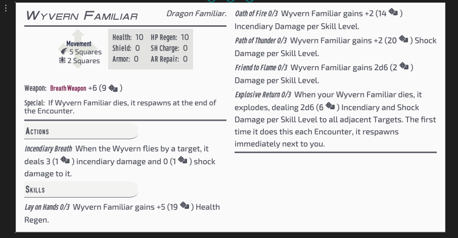

[[Fantasy Statblocks|Fantasy Statblocks]] > [[Integrated Layouts|Integrated Statblock Layouts]] > *You Are Here*

## Description

This is a layout for Familiars for Bunkers and Badasses TTRPG. 

A legal disclosure is included at the end of this page.

## Sample Image

>[!screenshot]- Screenshot of the Familiar Statblock
> 


## BnB Familiar Code Block

````yaml
```statblock
layout: Basic BnB Familiar Layout
Token:
Name: Wyvern Familiar
Type: "Dragon Familiar."
Health: "20"
Regen: "0"
Shield: "0"
Charge: "0"
Armor: "0"
Repair: "0"
Traits:
MovementType: flight 5
Weapon: "__Breath Weapon__"
Special: "If Wyvern Familiar dies, it respawns at the end of the Encounter."
Actions:
  - name: "Incendiary Breath"
    desc: "When the Wyvern flies by a target, it deals 1d6 (1d6) incendiary damage and 1d0 (0d0) shock damage to it."
Skills:
  - name: "Lay on Hands 0/3"
    desc: "Wyvern Familiar gains +5 Health Regen."
  - name: "Oath of Fire 0/3"
    desc: "Wyvern Familiar gains +2 Incendiary Damage per Skill Level."
  - name: "Path of Thunder 0/3"
    desc: "Wyvern Familiar gains +2 Shock Damage per Skill Level."
  - name: "Friend to Flame 0/3"
    desc: "Wyvern Familiar gains 1d6 (1d6) Damage per Skill Level."
  - name: "Explosive Return 0/3"
    desc: "When your Wyvern Familiar dies, it explodes, dealing 2d6 (2d6) Incendiary and Shock Damage per Skill Level to all adjacent Targets. The first time it does this each Encounter, it respawns immediately next to you."

Image: [[baby-wyvern.png]]
  ```
````

### BNB Familiar Empty Codeblock

````yaml
```statblock
layout: Basic BnB Familiar Layout
Token: Wikilink
Name: "String"
Type: "String"
Health: "Integer"
Regen: "Integer"
Shield: "Integer"
Charge: "Integer"
Armor: "Integer"
Repair: "Integer"
Traits: "String. String. [[Wiki-String]]."
MovementType: movement integer
Weapon: "String"
Special: "String"
Actions:
  - name: "String"
    desc: "String"
Skills:
  - name: "String"
    desc: "String"
  - name: "String"
    desc: "String"
  - name: "String"
    desc: "String"
  - name: "String"
    desc: "String"
  - name: "String"
    desc: "String"

Image: Wikilink
```
````

## Callbacks Used

### MovementType

This script,
built into the layout, converts `move`, `flight`, `swim`,`burrow`, `teleport`, `leap`, `hover`, and `climb` into icons.

An integer should follow each movement type. For example:

- `move 10`
- `swim 3`
- `fly 1`

```js
const Move = monster.MovementType;
const Types = ['move', 'flight', 'swim', 'burrow', 'teleport', 'leap', 'hover', 'climb',];
const Symbols = ['⭇', '󡔂', '󡔄', '󡔆', '󡔃', '󡔁', '󡔀', '󡔅',];

let Output = '';
for (let i = 0; i < Types.length; i++) {
  for (let j = 0; j <= 10; j++) {
    if (Move.includes(`${Types[i]} ${j}`)) {
      Output += `${Symbols[i]} ${j} Square${j > 1 ? 's' : ''}\n`;
    }
  }
}

return Output.trim();
```

## Legal Disclosure

Bunkers & Badasses and its associated content within the Borderlands Universe are copyrighted and trademarked to their respective entities within Nerdvana Games,
Gearbox Software, 2k Entertainment, and any party that may have a contractual interest upstream or downstream.
Rebbecca Bishop, aka Sigrunixia or LittleMaelstrom, submits this homebrew content as an alteration under 17 U.S. Code § 107 for fair use and entertainment purposes, and without exchange or acceptance of funds. 

Any infringements are accidental and can be reported to the submitter at rebbeccabishop@icloud.com. Allow time to check the junk mail.

For my portion, Obsidian Bunkers & Badasses © 2023 by Rebbecca Bishop is licensed under CC BY-NC-SA 4.0. To view a copy of this license, visit <http://creativecommons.org/licenses/by-nc-sa/4.0/>.
